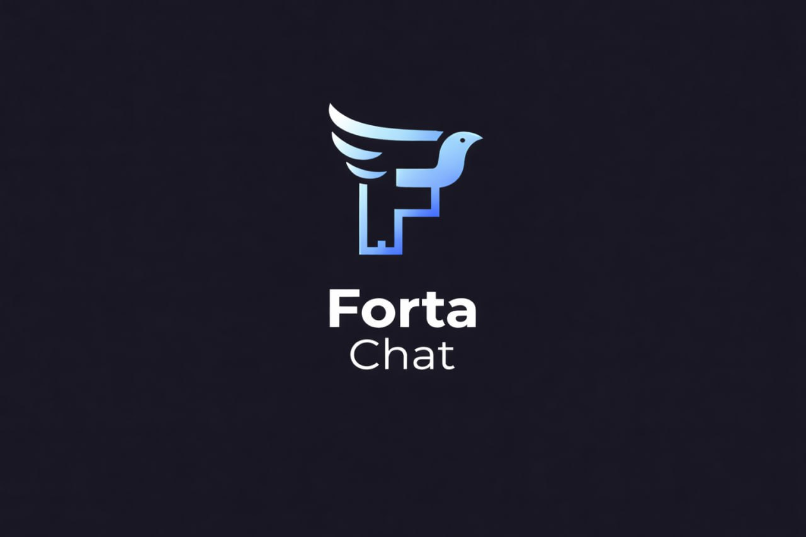

<div align="center">

**[English](README.md) · Русский**

<a href="https://forta.chat">
  
</a>

# Forta Chat

**Децентрализованный мессенджер на протоколе Matrix с интеграцией Bastyon**

[](https://github.com/pocketnetteam/forta.chat/releases/latest)
[](https://github.com/pocketnetteam/forta.chat/releases)
[](https://github.com/pocketnetteam/forta.chat/stargazers)
[](https://github.com/pocketnetteam/forta.chat/issues)
[](https://vuejs.org/)
[](https://www.typescriptlang.org/)
[](https://capacitorjs.com/)
[](https://www.electronjs.org/)

### [🌐 forta.chat](https://forta.chat) · [📥 Скачать](https://github.com/pocketnetteam/forta.chat/releases/latest) · [📖 Документация](#документация) · [🐛 Баги](https://github.com/pocketnetteam/forta.chat/issues) · [🔐 Bastyon](https://bastyon.com)

<br />

<a href="https://forta.chat">
  
</a>

</div>

---

## О проекте

**Forta Chat** — это end-to-end шифрованный мессенджер с архитектурой **local-first**: все сообщения, медиа и метаданные хранятся в IndexedDB на вашем устройстве, а синхронизация с Matrix-сервером идёт в фоне. Авторизация выполняется через приватный ключ аккаунта [Bastyon](https://bastyon.com) — никаких логинов и паролей.

Работает в вебе на [forta.chat](https://forta.chat), на десктопе (Windows / macOS / Linux) и на Android.

## Возможности

- 🔒 **E2E-шифрование** личных и групповых чатов (Matrix Olm/Megolm через `matrix-js-sdk-bastyon`)
- 📴 **Local-first**: Dexie (IndexedDB) как единственный источник правды, оффлайн-первая отправка через `SyncEngine` (FIFO + exponential backoff)
- 📞 **Видеозвонки** 1:1 и групповые через WebRTC — см. [docs/webrtc-architecture.md](docs/webrtc-architecture.md)
- 🎙 **Медиа**: фото, видео, голосовые, видеокружки, файлы с crash-recovery загрузкой
- 🌐 **Публичные комнаты и инвайт-ссылки**, реакции, опросы, read-watermarks, редактирование/удаление
- 🔑 **Вход через Bastyon**: приватный ключ Bastyon-аккаунта — см. [docs/how-to-get-private-key.md](docs/how-to-get-private-key.md)
- 🖥 **Кросс-платформенность**: Web, Electron (Windows/macOS/Linux), Android 7.0+ (API 24+)

## Скачать

| Платформа | Ссылка |
|-----------|--------|
| 🌐 **Web** | [forta.chat](https://forta.chat) |
| 🤖 **Android (APK)** | [releases/latest](https://github.com/pocketnetteam/forta.chat/releases/latest) |
| 🪟 **Windows** | собирается локально — см. [Electron](#electron-десктоп) |
| 🍎 **macOS** | собирается локально — см. [Electron](#electron-десктоп) |
| 🐧 **Linux** | собирается локально — см. [Electron](#electron-десктоп) |

## Технологический стек

| Слой | Технология |
|------|-----------|
| UI | Vue 3 (Composition API, `<script setup>`) + TailwindCSS |
| State | Pinia |
| Роутинг | Vue Router 4 |
| Сборка | Vite 5 |
| Типы | TypeScript 5.5 (strict) + `vue-tsc` |
| Тесты | Vitest + `@vue/test-utils` + happy-dom + fake-indexeddb |
| Хранилище | Dexie 4 (IndexedDB) |
| Чат-протокол | `matrix-js-sdk-bastyon` (Matrix fork от Bastyon) |
| Звонки | WebRTC |
| Десктоп | Electron 40 + electron-builder |
| Мобильный | Capacitor 8 (Android) |
| Крипто | `@noble/secp256k1`, `miscreant` (AEAD), `pbkdf2` |

## Быстрый старт

### Пререквизиты

- Node.js 18+
- npm 7+

### Установка

```bash
git clone https://github.com/pocketnetteam/forta.chat.git
cd forta.chat
npm install
```

### Dev-режим (web)

```bash
npm run dev
```

Откроется `http://localhost:5173`. Для авторизации понадобится приватный ключ Bastyon — инструкция: [docs/how-to-get-private-key.md](docs/how-to-get-private-key.md).

### Production-сборка

```bash
npm run build       # vue-tsc + vite build + минификация public JS
npm run preview     # превью собранной версии
```

### Тесты

```bash
npm run test        # one-shot
npm run test:watch  # watch-режим
```

## Сборка для платформ

### Electron (десктоп)

```bash
npm run electron:dev              # dev (vite + electron одновременно)
npm run electron:preview          # preview собранной версии в Electron
npm run electron:build            # сборка под текущую ОС
npm run electron:build:win        # Windows
npm run electron:build:mac        # macOS
npm run electron:build:linux      # Linux
```

Конфигурация — [electron-builder.json](electron-builder.json), main-процесс — [electron/main.cjs](electron/main.cjs).

### Android (Capacitor)

```bash
npm run cap:build   # vite build + cap sync android
npm run cap:open    # открыть проект в Android Studio
npm run cap:run     # запустить на подключённом устройстве
```

Полная инструкция по локальной сборке APK (debug/release, keystore, переменные окружения) — [docs/android-local-build.md](docs/android-local-build.md).

Capacitor-конфиг: [capacitor.config.ts](capacitor.config.ts) (`appId: com.forta.chat`, `minSdk 24`, `targetSdk 36`).

## Архитектура

Проект организован по **Feature-Sliced Design**:

```
src/
├── app/         # точка входа, провайдеры, роутинг, boot
├── pages/       # route-контейнеры
├── widgets/     # композиции фич (ChatSidebar, ChatWindow, layouts)
├── features/    # messaging, auth, contacts, video-calls, search, ...
├── entities/    # auth, chat, matrix, user, call, channel, media, ...
└── shared/      # ui, lib, composables, local-db (Dexie), config
```

Ключевые абстракции:

- **`shared/lib/local-db/ChatDatabase`** — Dexie-схема, репозитории (`MessageRepository`, `RoomRepository`, `UserRepository`)
- **`shared/lib/local-db/sync-engine.ts`** — offline-first FIFO-очередь отправки
- **`shared/lib/local-db/event-writer.ts`** — транзакционная запись Matrix-событий в Dexie
- **`shared/lib/local-db/decryption-worker.ts`** — фоновая дешифровка с retry
- **`shared/ui/ChatVirtualScroller.vue`** — кастомный виртуальный скролл (column-reverse)

Глубокие описания:

- [docs/local-first-architecture.md](docs/local-first-architecture.md) — Dexie, SyncEngine, EventWriter, decryption
- [docs/architecture-data-flow.md](docs/architecture-data-flow.md) — потоки данных, реактивность, жизненный цикл
- [docs/webrtc-architecture.md](docs/webrtc-architecture.md) — звонки, signaling, AudioRouter
- [docs/ux-specification.md](docs/ux-specification.md) — UX-спецификация экранов и потоков

## Документация

| Файл | О чём |
|------|-------|
| [CLAUDE.md](CLAUDE.md) | Правила для разработки (стек, архитектура, конвенции, верификация) |
| [docs/local-first-architecture.md](docs/local-first-architecture.md) | Local-first: Dexie, SyncEngine, EventWriter |
| [docs/architecture-data-flow.md](docs/architecture-data-flow.md) | Потоки данных и реактивность |
| [docs/ux-specification.md](docs/ux-specification.md) | UX-спецификация |
| [docs/webrtc-architecture.md](docs/webrtc-architecture.md) | Архитектура звонков |
| [docs/webrtc-calls-troubleshooting.md](docs/webrtc-calls-troubleshooting.md) | Траблшутинг звонков |
| [docs/webrtc-logs-analysis.md](docs/webrtc-logs-analysis.md) | Разбор логов WebRTC |
| [docs/webrtc-solution-proposal.md](docs/webrtc-solution-proposal.md) | Предложения по улучшению звонков |
| [docs/android-local-build.md](docs/android-local-build.md) | Локальная сборка Android APK |
| [docs/how-to-get-private-key.md](docs/how-to-get-private-key.md) | Как получить приватный ключ Bastyon |
| [docs/plans/](docs/plans/) | Дизайн-документы и планы фич |

## Разработка

Перед коммитом обязательно прогнать полную верификацию:

```bash
npm run build              # сборка (vue-tsc + vite)
npx vue-tsc --noEmit       # проверка типов
npm run test               # тесты
```

Конвенции, правила по изоляции через git worktrees, TDD, code review и прочее — в [CLAUDE.md](CLAUDE.md).

Коммит-сообщения: [Conventional Commits](https://www.conventionalcommits.org/) (`fix:`, `feat:`, `refactor:`, `docs:`, `test:`, `perf:`, `chore:`).

## Юридическая информация

- [Политика конфиденциальности](https://forta.chat/privacy.html)
- [Условия использования](https://forta.chat/terms.html)

## Ссылки

- 🌐 Сайт: [forta.chat](https://forta.chat)
- 📦 Репозиторий: [github.com/pocketnetteam/forta.chat](https://github.com/pocketnetteam/forta.chat)
- 📥 Релизы: [github.com/pocketnetteam/forta.chat/releases](https://github.com/pocketnetteam/forta.chat/releases)
- 🐛 Issues: [github.com/pocketnetteam/forta.chat/issues](https://github.com/pocketnetteam/forta.chat/issues)
- 🔐 Bastyon: [bastyon.com](https://bastyon.com)

<div align="center">
<sub>Made with ❤️ for decentralized communication</sub>
</div>
